# Projet Sessions sur Symfony

 

    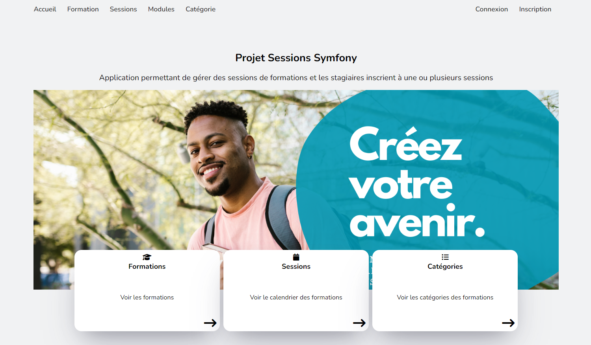
 

  

    <a href="https://github.com/fredericbranca/SessionSymfony"><strong>Parcourir les documents »</strong></a>
     
     
  

## Description générale
Le projet "SessionSymfony" est une application Symfony qui permet de gérer des sessions de formations et les stagiaires inscrits à une ou plusieurs sessions. L'application offre la possibilité de créer, modifier et visualiser des sessions, des stagiaires, des formations, des programmes (module ainsi que sa catégorie). L'interface utilisateur est intuitive et bien organisée, offrant une navigation facile entre les différentes sections.

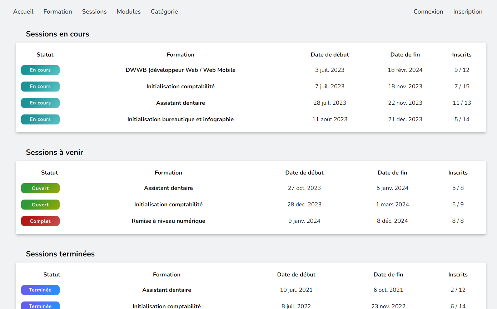
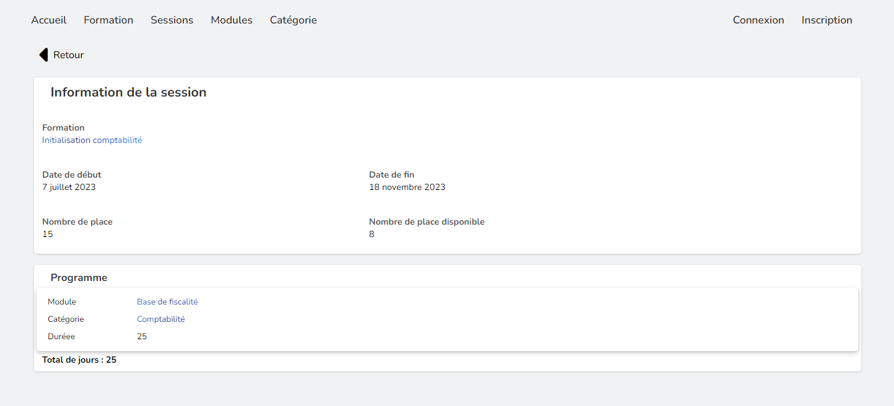
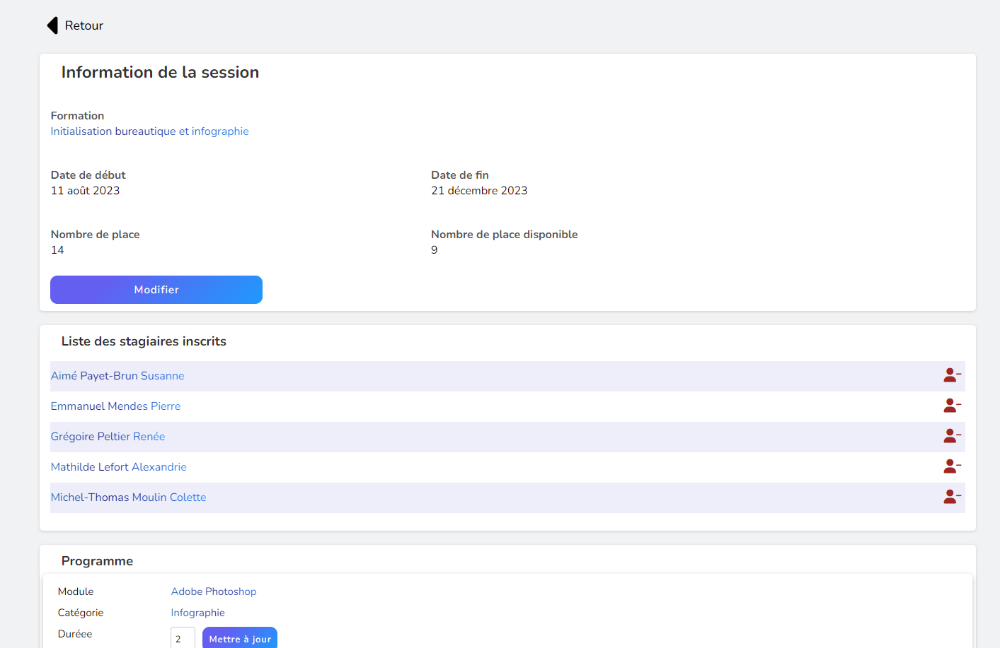
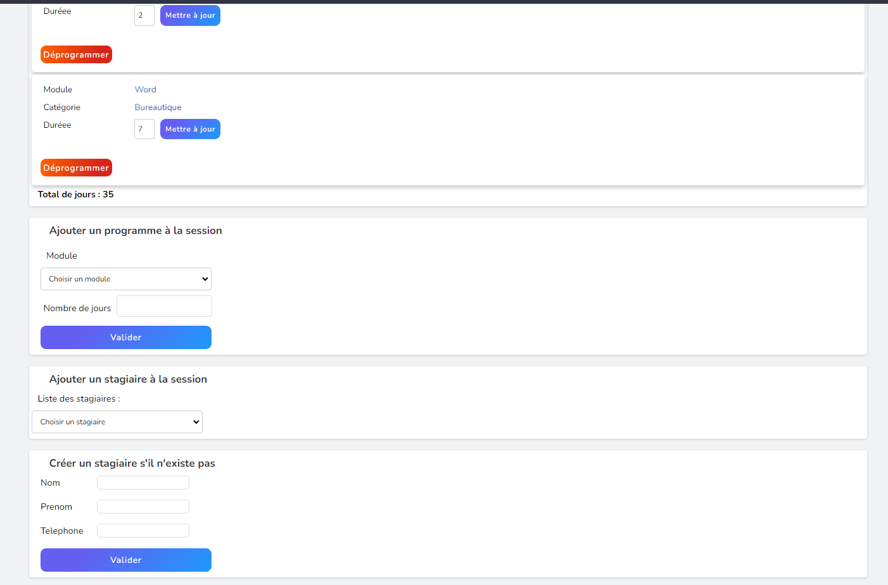
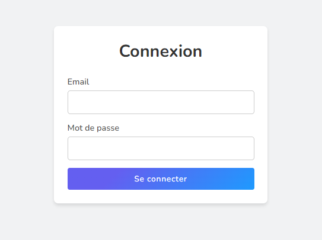
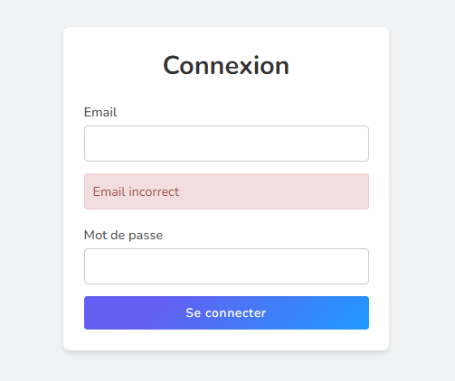
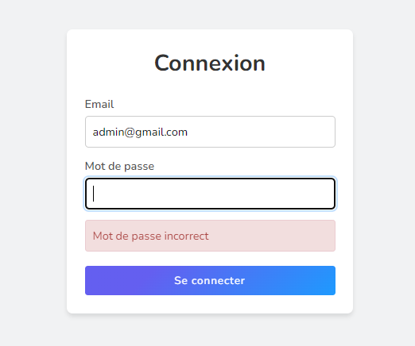
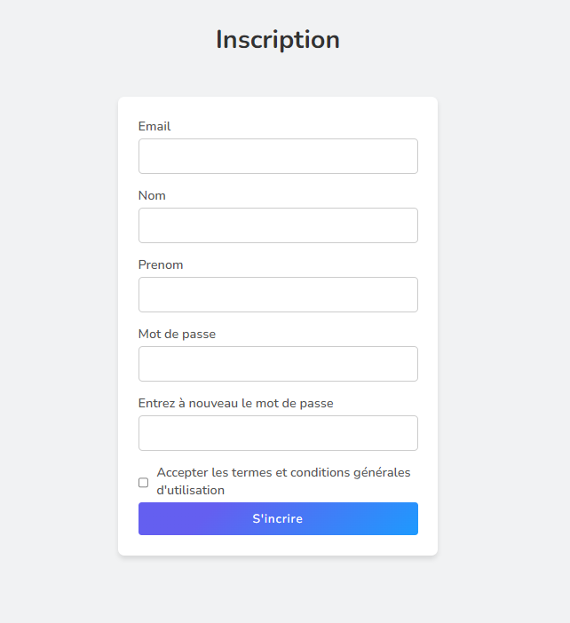
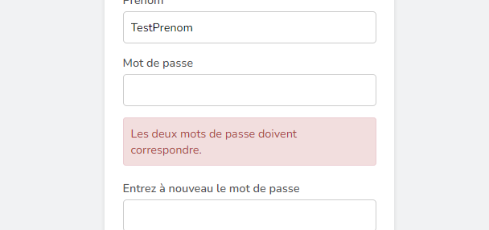
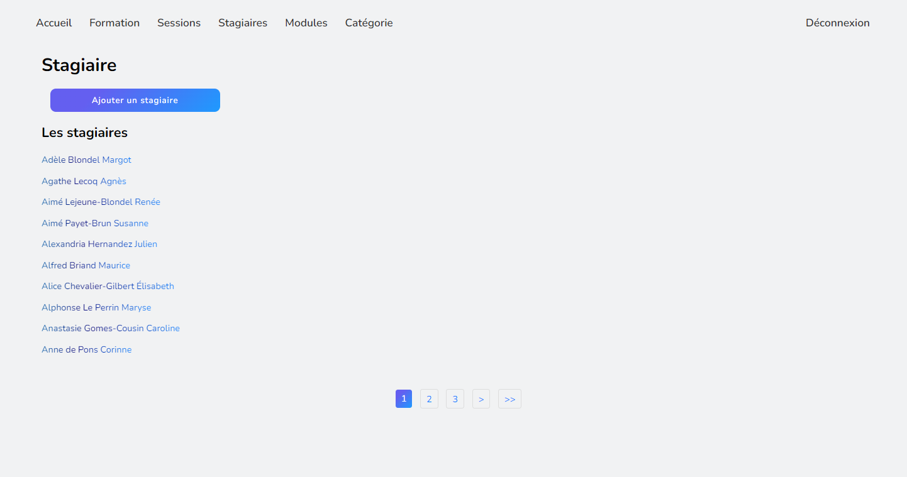
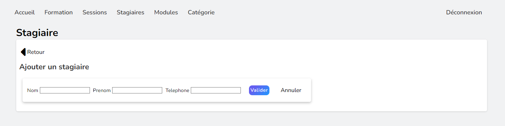
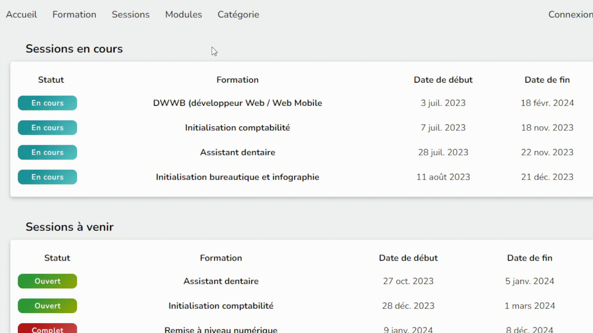

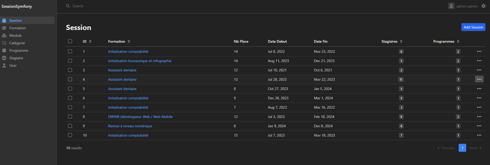
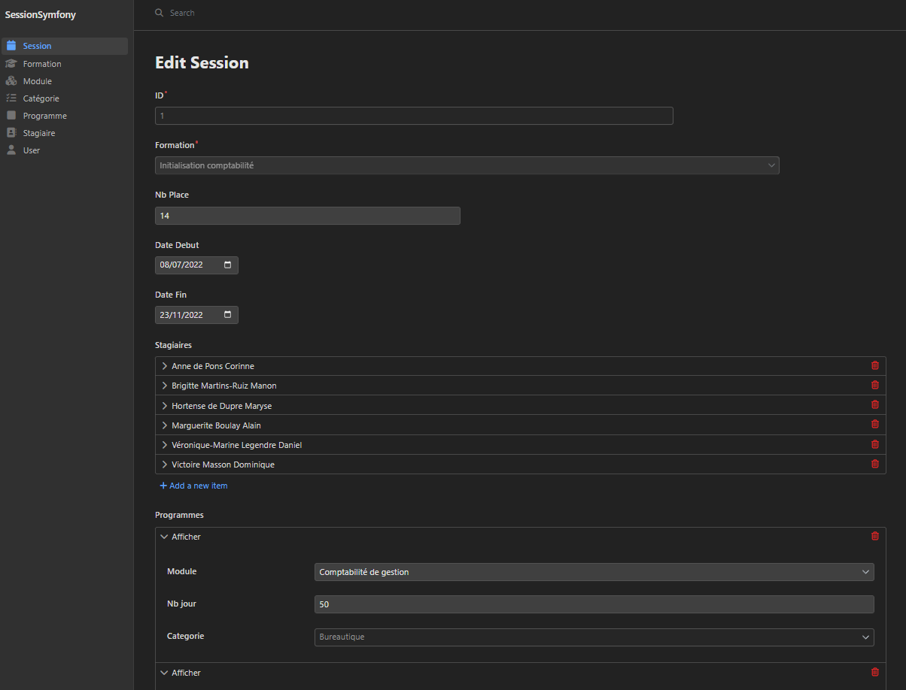

